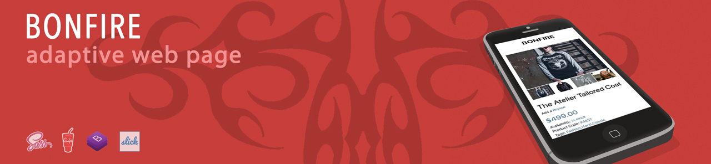

# BonFire

  

# Synopsis
This project is the practice of creating websites. In this case, a free template was selected; the site was made up from the Photoshop’s template.

# Motivation
In this project, knowledges of using Bootstrap 4, understanding CSS styling, setting up site sizes for various devices were consolidated.

# Tests
On any device the site displays correctly, issues were not detected.

# Technologies
* HTML;
* CSS, SASS, Bootstrap 4, Media queries;
* Gulp;
* Adobe Photoshop.

# Example          

